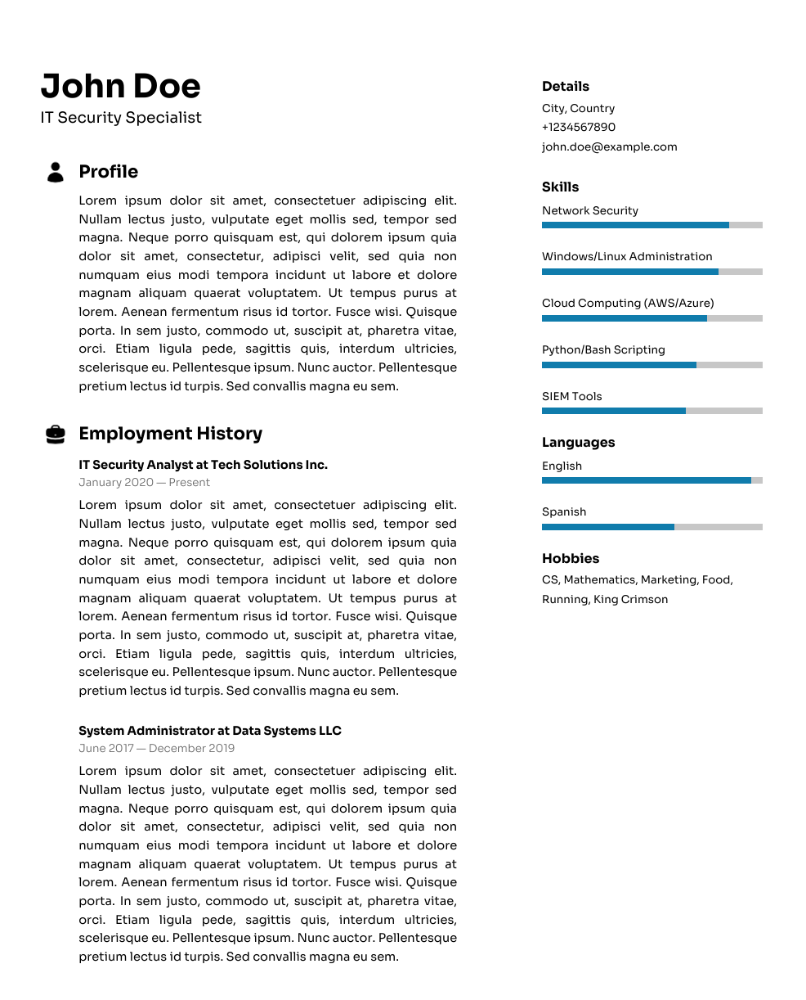

# 📝 CVPDF

CVPDF is a quick and lightweight python solution for generating a modern CV from XML input.

## 📄 What It Does

-   Reads personal, professional, and other CV-related information from an XML file.
    
-   Uses the `fpdf` library to generate a formatted PDF.
    
-   Supports sections like:
    
    -   Name and title
        
    -   Profile summary
        
    -   Employment history
        
    -   Skills (with progress bars)
        
    -   Languages
        
    -   Hobbies
        
    -   Contact details

 
        

## 📂 Files

-   `cv_generator.py`: Main script that reads XML and outputs the PDF.
    
-   `contents.xml`: Example XML file with all supported tags and structure.
    
-   `fonts/`: Contains the custom fonts used for styling.
    
-   `icons/`: Small icons used for section headers (e.g., user, briefcase).
    

## ▶️ How to Use

1.  Make sure you have the required dependencies:# 📝 CV Generator from XML

This Python script generates a styled PDF CV/resume from an XML input file.

## 📄 What It Does

- Reads personal, professional, and other CV-related information from an XML file.
- Uses the `fpdf` library to generate a beautifully formatted PDF.
- Supports sections like:
  - Name and title
  - Profile summary
  - Employment history
  - Skills (with progress bars)
  - Languages
  - Hobbies
  - Contact details

## 📂 Files

- `cv_generator.py`: Main script that reads XML and outputs the PDF.
- `contents.xml`: Example XML file with all supported tags and structure.
- `fonts/`: Contains the custom fonts used for styling.
- `icons/`: Small icons used for section headers (e.g., user, briefcase).

## ▶️ How to Use

1. Make sure you have the required dependencies:

    ```bash
    pip install fpdf
    ```

2. Update the `contents.xml` file with your own details. All supported XML tags are included as examples in that file.

3. Run the script:

    ```bash
    python cv_generator.py
    ```

4. The generated PDF will be saved as `cv_from_xml.pdf`.

## 📑 XML Structure

The XML file includes tags like:

```xml
<personal>
    <name>John Doe</name>
    <title>Software Developer</title>
    <location>City, Country</location>
    <phone>+1234567890</phone>
    <email>john@example.com</email>
</personal>

<profile>
    <summary>Brief profile summary goes here.</summary>
</profile>

<employment>
    <job>
        <title>Developer</title>
        <company>Company Name</company>
        <dates>Jan 2020 - Present</dates>
        <description>Job responsibilities and achievements.</description>
    </job>
</employment>

<skills>
    <skill name="Python" level="90"/>
    <skill name="JavaScript" level="80"/>
</skills>

<languages>
    <language name="English" level="100"/>
    <language name="Spanish" level="70"/>
</languages>

<hobbies>
    <hobby>Reading</hobby>
    <hobby>Traveling</hobby>
</hobbies>
